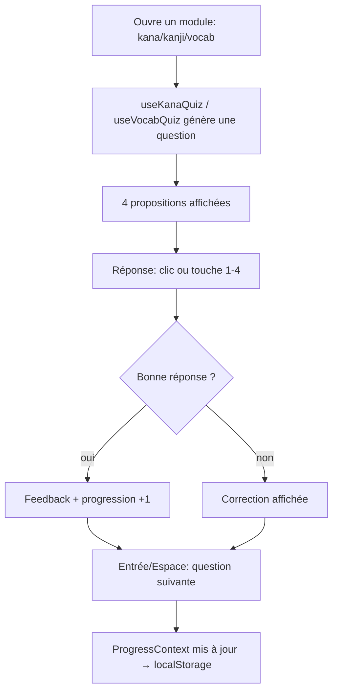
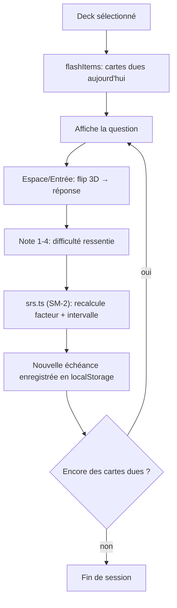
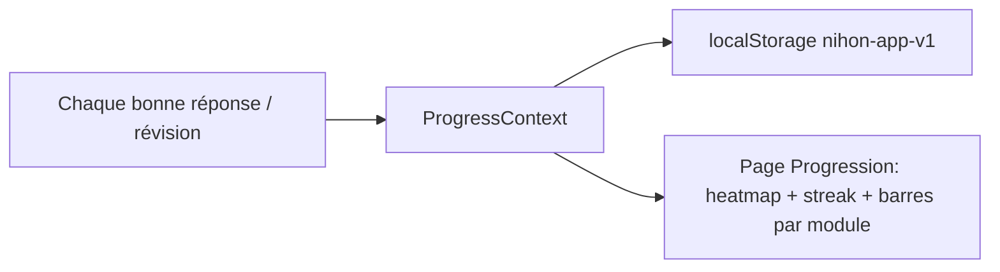

# Workflows (Mermaid)

## 1. Un quiz de module

```mermaid
flowchart TD
    A[Ouvre un module: kana/kanji/vocab] --> B[useKanaQuiz / useVocabQuiz génère une question]
    B --> C[4 propositions affichées]
    C --> D[Réponse: clic ou touche 1-4]
    D --> E{Bonne réponse ?}
    E -->|oui| F[Feedback + progression +1]
    E -->|non| G[Correction affichée]
    F --> H[Entrée/Espace: question suivante]
    G --> H
    H --> I[ProgressContext mis à jour → localStorage]
```

## 2. Session de flashcards (SM-2)

```mermaid
flowchart TD
    A[Deck sélectionné] --> B[flashItems: cartes dues aujourd'hui]
    B --> C[Affiche la question]
    C --> D[Espace/Entrée: flip 3D → réponse]
    D --> E[Note 1-4: difficulté ressentie]
    E --> F["srs.ts (SM-2): recalcule facteur + intervalle"]
    F --> G[Nouvelle échéance enregistrée en localStorage]
    G --> H{Encore des cartes dues ?}
    H -->|oui| C
    H -->|non| I[Fin de session]
```

## 3. Progression

```mermaid
flowchart LR
    A[Chaque bonne réponse / révision] --> B[ProgressContext]
    B --> C[localStorage nihon-app-v1]
    B --> D[Page Progression: heatmap + streak + barres par module]
```
